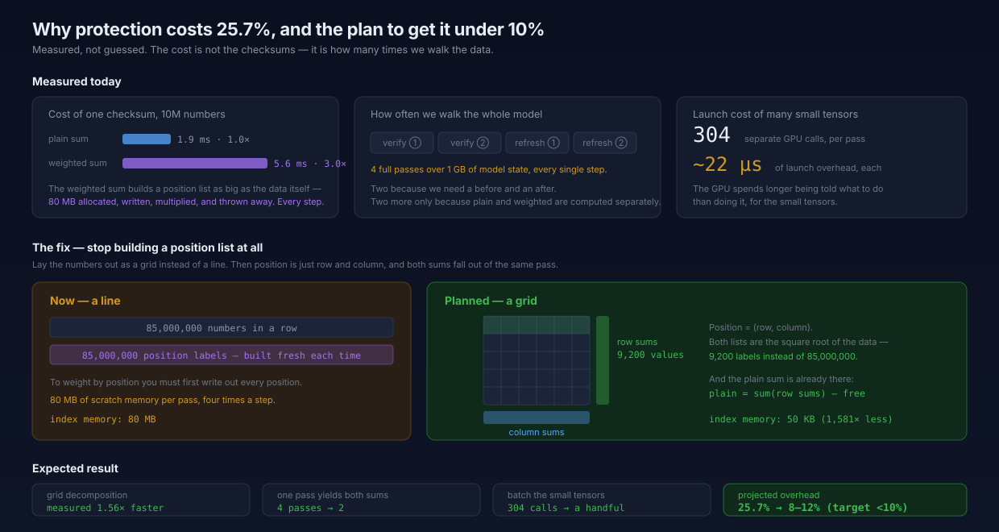

# orbital-runtime

**A software runtime that keeps commercial GPUs computing correctly through radiation in orbit.**

Datacenter GPUs are going to orbit by the thousands (Starcloud, Google Suncatcher, Axiom, SpaceX
filings). Cosmic radiation corrupts their computation. Error-correcting memory catches part of it.
Nothing protects the job itself.

This runtime wraps an **unmodified PyTorch job**. It injects faults at published orbital rates,
detects the corruption that results, **repairs most of it in place**, and rolls back only when it
cannot. Every physics constant traces to a citation.



---

## Orientation

Read this first. It is reference material for someone who has not seen this repo before.

### What this is

`orbital-runtime` wraps an unmodified PyTorch training or inference job and keeps it
computing correctly through radiation-induced bit flips. It injects faults at calibrated
orbital rates, detects the corruption that results, repairs most of it in place, and rolls
back only when it cannot. It targets operators putting commercial GPUs in orbit, where a
particle strike corrupts a number and nothing in the existing stack notices.

### Repo map

Load-bearing modules, in the order a fault travels through them.

| Path | What it does | Weight |
|---|---|---|
| `orbital_runtime/orbit/track.py` | Parametric 95-minute LEO orbit, phase-gated SAA window. | Load-bearing |
| `orbital_runtime/orbit/flux.py` | Time-varying Poisson intensity: base rate x resident bits x SAA x storm. Also the ECC SDC-to-DUE redistribution. | Load-bearing |
| `orbital_runtime/inject/gpu_model.py` | Samples the measured GPU fault distribution (Tung et al., DSN 2026): nullification, bit flip, NaN/Inf, and the bit-position prior. Every other injector asks this what kind of fault to produce. | Load-bearing |
| `orbital_runtime/inject/memory.py` | Faults in STORED state: weights and Adam moments. Multi-bit clusters, warp-aligned tracks, write-path nullification. Owns `flip_bit`, the exact integer-view XOR every injector uses. | Load-bearing |
| `orbital_runtime/inject/compute.py` | Faults in values IN FLIGHT: forward hooks on activations, reattached to the autograd graph so corruption reaches gradients. | Load-bearing |
| `orbital_runtime/inject/injector.py` | Owns the whole fault timeline. Draws the schedule before step 0 from named RNG streams, which is what makes protected and unprotected runs face identical bombardment. | Load-bearing |
| `orbital_runtime/inject/sefi.py`, `xid.py` | Device-level functional interrupts and the Xid stream. | Peripheral |
| `orbital_runtime/detect/guards.py` | Tier 1. Free checks on scalars the loop already computed: isfinite, grad-norm z-score, loss spike. | Load-bearing |
| `orbital_runtime/detect/integrity.py` | Tier 2. Exact integer checksums over all resident state, plus locate-and-repair. The largest and most important detector. Covers optimizer state, which is two thirds of strikeable bits. | Load-bearing |
| `orbital_runtime/detect/abft.py` | Tier 3. Sampled checksums around `nn.Linear` GEMMs. The only tier that can see a corrupted computation whose stored weights are still clean. **Does not work in bf16, see Known limits.** | Load-bearing |
| `orbital_runtime/detect/watcher.py` | Tier 4. Consumes real ECC and Xid counters through DCGM, simulated when absent. | Peripheral |
| `orbital_runtime/detect/verdict.py` | The `Verdict` type and the tier and reason constants. Read it to know what a detection looks like. | Small, read it early |
| `orbital_runtime/ckpt/` | `saver.py`, `policy.py`, `recover.py`. Distributed checkpoints, 4 slots, orbit-aware cadence. | Load-bearing for recovery |
| `orbital_runtime/run.py`, `train.py` | CLI and the training loop that wires injection, detection and recovery together in the one correct order. | Load-bearing |
| `orbital_runtime/rng.py` | Named RNG streams. Everything deterministic depends on this. | Small, load-bearing |
| `orbital_runtime/workload.py` | The tiny interface a workload must satisfy: a model, an optimizer, a loss for a step. | Small |
| `demo/workloads/nanogpt/` | The char-level GPT used by every bench and test. | Support |
| `demo/dashboard/` | Self-contained local HTML dashboard. No server, no CDN. | Peripheral |
| `bench/sdc_campaign.py` | Outcome campaign: masked, detected, SDC, per bit position, per format, undefended against defended. | Load-bearing |
| `bench/detect_eval.py`, `recall_by_class.py`, `coverage_audit.py`, `fault_model_audit.py` | Detector-side measurement: recall, per-class recall, structural coverage, injector-vs-published drift. | Support |
| `bench/overhead.py`, `protect_overhead_calibrated.py` | Timing. | Support |
| `tests/` | 373 passing, 2 skipped. `test_integrity.py`, `test_abft.py` and `test_sdc_campaign.py` are the big three. | Load-bearing |

The distinction that matters most: `inject/memory.py` and `detect/integrity.py` are the
STORED-state pair. `inject/compute.py` and `detect/abft.py` are the IN-FLIGHT pair. A fault
in one path is structurally invisible to the other path's detector.

### How to run things

```bash
make venv install data          # .venv, editable install, tinyshakespeare corpus
make test                       # full suite, about 60s
.venv/bin/pytest tests/test_sdc_campaign.py    # just the campaign harness
```

Run the three-way demo, a clean baseline against an irradiated run against a protected run:

```bash
make demo                       # writes runs/, then demo/dashboard/index.html
```

Run an outcome campaign:

```bash
M="--n-layer 6 --n-embd 384 --n-head 6 --block-size 128 --batch-size 8 --warmup 300 --eval-batches 4"
.venv/bin/python -m bench.sdc_campaign --arm paired --sweep bits --trials 100 \
  --target weight --dtype float32 $M --json bench/results/sdc/out.json
```

Flags worth knowing:

| Flag | Meaning |
|---|---|
| `--target` | `weight`, `optimizer`, `activation`, `gradient`. Optimizer and gradient need `--mode train`, because a forward pass never reads them. |
| `--arm` | `undefended` (no detector, the customer-facing number), `defended`, or `paired` (both on the same site and bit). |
| `--dtype` | `float32`, `bfloat16`, `float16`. Sets the bit-sweep width: 32 bits or 16. |
| `--sweep` | `bits` holds the bit fixed and varies the site. `uniform` draws bits from `--bit-model`. |
| `--bit-model` | `uniform` or `gpu` (the measured LSB-biased prior). Changes the blended rate substantially. |
| `--mode` | `inference` or `train`. Train runs `--train-steps` real steps after the injection. |
| `--noise-band N` | Trains N extra seeds and reports the spread between independently trained models. Context only, not a threshold. |
| `--device` | `cpu`, `cuda`, `mps`. |
| `--threads` | Recorded in the JSON because it changes the result, not just the speed. |

Each campaign writes a text report and a JSON holding the config, per-bit summaries, and
one record per trial.

### State of the evidence

| Directory | Hardware | Contents |
|---|---|---|
| `bench/results/sdc/` | CPU, Apple Silicon, torch 2.13.0 | fp32 campaigns: weights, activations, optimizer and gradient in train mode, both bit priors. Undefended only, plus a thread-count recheck. |
| `bench/results/sdc-l4/` | NVIDIA L4 24GB, torch 2.7.0+cu128 | fp32 and bf16 weights, fp32/bf16/fp16 activations, both bit priors, all paired undefended against defended. ECC counters before and after. |
| `bench/results/` | Mixed, see each file's `config` block | Older detector-side artifacts. Files tagged `_l4` came from a rented GPU that no longer exists. |

Every JSON records its own device, dtype, thread count, seed, model size and torch version.
Trust that block over any filename. Results are in the outcome-campaign section below.

### Known limits and open work

Consolidated here so they are in one place rather than scattered through the prose.

1. **Checksum ABFT has a precision floor it cannot cross.** The corruption is compared
   against an output already rounded to the working format, so anything smaller than
   `eps_store * L1(y)` is indistinguishable from that rounding. In bf16 that is 0.8% of a
   row's entire L1 magnitude. A `sqrt(K)` double-count on top of it was found and fixed
   (`_tolerance_terms`), which took bf16 SDC removal from 0.0% to 11.8% and fp32 from
   96.2% to 100%, but the floor itself is not removable and it is the largest open problem
   in the repo. bf16 is the format the compute path runs in.
2. **Compute-path recall is 69.3%**, under the repo's own 70% gate.
3. **ABFT fires on faults that have no consequence.** It fired on 36.9% of fp32 activation
   trials while 21.5% were actually SDCs. Real faults, no harm, no value delivered.
4. **Protection overhead is 25.7%** against a target under 10%. The fix is measured and
   unimplemented.
5. **Single-bit faults only** in the outcome campaign. Fewer than 40% of real GPU bit-flip
   events are single-bit.
6. **Tensor-level injection, not SASS-level.** Calibrated against published data. Not
   beam-validated. No proton beam campaign has been run.
7. **No fp16 campaign** beyond the activation arm.
8. **Optimizer and gradient targets were never run on the L4.** They exist on CPU only.
9. **CPU paired arms were never run.** The defended arm is L4-only. CPU is undefended only.
10. **`--target gradient` has no defended arm** and refuses to run one, because the
    integrity tier must run before `optimizer.step()` and a gradient fault only reaches the
    state through that step.
11. **No hang detection.** Campaign trials run in process, so a hang stalls the campaign
    rather than being classified.

### Traps that cost time

Each of these produced a plausible, wrong, flattering result before it was found.

1. **`IntegrityTier.check_now()` rate-limits against the last step it scanned, and
   `reset()` does not clear that bookkeeping.** Pass a monotonically increasing step. A
   constant step makes every call after the first skip its scan and report zero detections,
   which looks like the detector failing.
2. **Forward hooks fire in registration order.** An injector standing in for a fault inside
   a GEMM must attach BEFORE ABFT. Attach ABFT first and it verifies the clean tensor and
   passes every time, which reads as "ABFT detects nothing".
3. **Reduce the loss in fp32 even when the model is bf16.** A native bf16 reduction is too
   coarse to resolve the corruption, so every bf16 SDC reports a loss delta of exactly zero
   and the number describes the observable rather than the fault.
4. **CPU thread count changes the trained weights.** Matmul reduction order depends on it,
   so the same seed at `--threads 3` and `--threads 8` trains different models with
   different sensitivity, and the masked/SDC split moves several points. Record `--threads`
   with any CPU number you quote.
5. **Anything dtype-aware must take the dtype explicitly.** Hard-coding `torch.float32` in a
   hook or a tensor filter makes a bf16 campaign silently do nothing and report 100% masked.
6. **`check_now()` must run before `optimizer.step()`, `refresh()` immediately after it.**
   Reversed, the tier compares legitimately updated state against a stale snapshot and
   false-positives on every step.
7. **`bench/results/` is gitignored** but its contents are tracked. New result files need
   `git add -f`.

---

## The idea that makes it work

Detection is not the hard part. **Response** is.

A rollback throws away the model, reloads a checkpoint, and redoes every step since — while
radiation keeps arriving. At 85 million parameters that cost 76 replayed steps and the run still
died.

So the runtime does not roll back for a single corrupted number. It **finds that number and undoes
it**. Two checksums over the same tensor are enough: the plain sum says something changed, and the
index-weighted sum divided by it says exactly where.



Measured on an NVIDIA L4 at 85.3M parameters under 49 radiation hits: **39 of 42 corruptions
repaired exactly, 3 needed a rollback, the run completed.**

---

## Headline results

Measured on a rented **NVIDIA L4 24GB**, **85.3M-param GPT-2-class nanoGPT**, 8.19e9 resident bits,
300 steps, one orbit, at the **calibrated 1e-7 upsets/bit-day flight rate with no elevation.**

| | Unprotected | Protected |
|---|---|---|
| Outcome | **DIED — nan_loss at step 73** | **COMPLETED 300/300** |
| Upsets delivered | 2 | **49** (43 in the SAA) |
| Corruptions repaired in place | — | **39 of 42** |
| Rollbacks | — | 3 |
| Steps replayed | — | 25 |

Both runs face a **bit-identical bombardment** drawn before step 0 from named RNG streams, so
protection cannot change the radiation. It is a controlled experiment, not a demo.

### Detector recall, by measured GPU fault class

Recall is reported per class, because a blended number hides the class that dominates real faults.

| Path / class | Detection | Escalation | Missed |
|---|---|---|---|
| memory / nullification | **100%** | 82.5% | 0 |
| memory / bit flip | **100%** | 11.7% | 0 |
| memory / special (NaN) | **100%** | 96.2% | 0 |
| compute / nullification | 97.5% | 97.5% | 3 |
| compute / bit flip | **39.2%** | 39.2% | 73 |
| compute / special (NaN) | **100%** | 100% | 0 |

**Memory path: 100% share-weighted. Compute path: 69.3%.**

Detection and escalation are separate columns on purpose. A fault that is repaired or deliberately
absorbed was **seen**. Counting it as a miss would be dishonest in the flattering direction.

---

## Outcome campaign: what one bit flip does to an undefended run

Every other bench here measures a detector. This one turns the detectors off and measures
the fault, because the claim the product rests on is not "we catch faults". It is "faults
that nobody catches produce answers that look fine and are wrong".

`bench/sdc_campaign.py`. Software only. No proton beam and no radiation source.

### The taxonomy

Each trial flips exactly one bit in a warm workload and lands in one bucket.

| Outcome | Meaning |
|---|---|
| `masked` | The output is bit-identical to the golden run. |
| `detected` | The run raised, or the output holds a NaN or an Inf. |
| `sdc` | The run finished, raised nothing, every output value is finite, and the output differs. |

`detected` is the DUE-equivalent bucket. On silicon a DUE comes from ECC or an Xid. In a
software injector the analogue is a failure loud enough that a free screen catches it,
which is what `detect/guards.py` is.

Comparison is bitwise with no tolerance, and it needs no noise band, because **run-to-run
noise on a fixed seed is zero, not small.** Every campaign runs 8 uninjected control
trials before it starts and aborts unless all 8 come back bit-identical. All of them did,
on CPU and on CUDA. There is no threshold to argue about and no variance for a fault to
hide inside: an uninjected run of this workload reproduces exactly, so any difference at
all is the injected bit and nothing else.

### Method

A char-level nanoGPT of 10.72M parameters: 6 layers, 6 heads, 384 embedding dimensions,
128-token context, batch size 8, tinyshakespeare. Seed 1337. The model trains 300 steps
in fp32 before the first injection, so faults land in a model that has learned something.
Narrow formats are cast after that warmup, which is also what deployment does.

The observable is what the job returns: the mean cross-entropy as a float64, reduced in
fp32, and the predicted token at each of 4096 positions. The target element is drawn
uniformly across all resident elements of the campaign format, so a 384-element LayerNorm
gain is not as likely a target as a 25M-element embedding.

### Headline, undefended, measured on an NVIDIA L4 24GB

`torch 2.7.0+cu128`, CUDA, seed 1337. Brackets are 95% Clopper-Pearson intervals.

| Campaign (all L4-measured) | n | masked | detected | SDC | SDC changing a token |
|---|---:|---|---|---|---|
| fp32 weights, all 32 bits | 3200 | 46.6% [44.8, 48.3] | 1.8% [1.4, 2.3] | 51.7% [49.9, 53.4] | 2.9% [2.4, 3.5] |
| bf16 weights, all 16 bits | 1600 | 5.7% [4.6, 6.9] | 3.6% [2.8, 4.7] | 90.7% [89.2, 92.1] | 53.6% [51.1, 56.0] |
| fp32 activations, all 32 bits | 1600 | 76.6% [74.5, 78.7] | 1.9% [1.3, 2.7] | 21.5% [19.5, 23.6] | 1.8% [1.2, 2.5] |
| fp32 weights, uniform bit prior | 2000 | 48.3% [46.1, 50.5] | 1.7% [1.2, 2.4] | 50.0% [47.8, 52.2] | 2.5% [1.9, 3.3] |
| fp32 weights, measured GPU prior | 2000 | 65.7% [63.6, 67.8] | 0.4% [0.2, 0.8] | 33.9% [31.8, 36.0] | 0.8% [0.4, 1.2] |

Across all 10,400 undefended L4 trials, **not one raised an exception**. Every detection
was a non-finite value, which is the single failure a NaN screen catches for free.

### Which format each table models

Mixed-precision training does not put everything in one format, so the fp32 and bf16
tables are complementary rather than competing. Read them this way:

| Table | Models |
|---|---|
| fp32 weights, fp32 optimizer state | The master weights and Adam moments, which the optimizer keeps in fp32. This is the real mixed-precision regime for stored state. |
| bf16 activations | Everything in flight: activations, the compute path, and the GEMM outputs. This is the real mixed-precision regime for values in motion. |
| bf16 weights | Weights stored narrow, which is how models are commonly served for inference. It is NOT what mixed-precision training does to master weights. |

Bit indices are 0-31 for fp32 and 0-15 for bf16 and fp16. No table below mixes them.

### Narrow formats absorb far less

bf16 keeps all 8 exponent bits of fp32 and pays for them out of the mantissa, so there are
7 low bits left to absorb a flip harmlessly instead of 23. fp16 spends the other way: 5
exponent bits and 10 mantissa bits.

Weights, L4-measured, same seed and same model, differing only in stored format. The bf16
row is the serving case, not the training case.

| L4-measured, weights | bits | n | masked | SDC | changed a token |
|---|---|---:|---|---|---|
| fp32 | 0-31 | 3200 | 46.6% | 51.7% | 2.9% |
| bf16 | 0-15 | 1600 | 5.7% | 90.7% | 53.6% |

Activations in flight, L4-measured. This is the row that describes the mixed-precision
compute path.

| L4-measured, activations | bits | n | masked | detected | SDC | changed a token |
|---|---|---:|---|---|---|---|
| fp32 | 0-31 | 1600 | 76.6% | 1.9% | 21.5% | 1.8% |
| bf16 | 0-15 | 1600 | 35.7% | 2.9% | 61.4% | 8.2% |
| fp16 | 0-15 | 1600 | 45.0% | 1.2% | 53.8% | 3.8% |

Moving the compute path from fp32 to bf16 cuts the harmless fraction by more than half and
raises token-changing corruption 4.6x. fp16 sits between the two, which is what its wider
mantissa predicts.

### Bit position decides the outcome

fp32 weights, L4-measured, 100 injections per bit position.

| Field | Bits | n | masked | detected | SDC | SDC changing a token |
|---|---|---:|---|---|---|---|
| mantissa | 0-22 | 2300 | 60.2% | 0.0% | 39.8% | 0.0% |
| exponent | 23-30 | 800 | 12.4% | 7.1% | 80.5% | 11.2% |
| sign | 31 | 100 | 7.0% | 0.0% | 93.0% | 2.0% |

bf16 weights, L4-measured, 100 injections per bit position.

| Field | Bits | n | masked | detected | SDC | SDC changing a token |
|---|---|---:|---|---|---|---|
| mantissa | 0-6 | 700 | 12.3% | 0.0% | 87.7% | 37.4% |
| exponent | 7-14 | 800 | 0.6% | 7.2% | 92.1% | 65.9% |
| sign | 15 | 100 | 0.0% | 0.0% | 100.0% | 68.0% |

Selected fp32 bit positions, L4-measured. The last column is the median change in
validation loss across the silent failures at that bit.

| Bit | Field | masked | detected | SDC | SDC changing a token | median loss delta |
|---:|---|---|---|---|---|---|
| 0 | mantissa | 93.0% | 0.0% | 7.0% | 0.0% | 6.0e-08 |
| 8 | mantissa | 55.0% | 0.0% | 45.0% | 0.0% | 6.0e-08 |
| 16 | mantissa | 49.0% | 0.0% | 51.0% | 0.0% | 6.0e-08 |
| 22 | mantissa | 31.0% | 0.0% | 69.0% | 1.0% | 6.0e-08 |
| 23 | exponent | 19.0% | 0.0% | 81.0% | 1.0% | 1.2e-07 |
| 25 | exponent | 5.0% | 0.0% | 95.0% | 22.0% | 7.7e-07 |
| 29 | exponent | 20.0% | 0.0% | 80.0% | 0.0% | 1.8e-07 |
| 30 | exponent | 0.0% | 57.0% | 43.0% | 43.0% | 1.6e+00 |
| 31 | sign | 7.0% | 0.0% | 93.0% | 2.0% | 2.4e-07 |

The shape is the expected one and it is not smoothed. Two mechanisms drive the exponent
column. A flip that lowers the exponent divides the weight toward zero, and one zeroed
weight out of 32 million changes little. A flip that raises it multiplies the weight, and
that is what moves the answer. Bit 30 multiplies by about 2^128, which is large enough to
reach infinity part of the time and be caught.

**One bit position produces every detection.** Of 187 detections across all 10,400
undefended L4 trials, 129 were at fp32 bit 30 and 58 were at bf16 bit 14. Those are the
same bit: the top exponent bit of each format. No other bit position in either word
produced a single detection.

### What "wrong" means, under three thresholds

A bit-exact diff over-reports, so the campaign records enough per trial to apply a
stricter test afterward. All three columns are L4-measured, from the same trials.

| L4-measured campaign | n | any bit difference | a predicted token changed | loss moved past the seed-to-seed spread |
|---|---:|---|---|---|
| fp32 weights | 3200 | 51.7% | 2.9% | 0.9% |
| bf16 weights | 1600 | 90.7% | 53.6% | 2.1% |
| fp32 activations | 1600 | 21.5% | 1.8% | 0.1% |
| fp32 uniform prior | 2000 | 50.0% | 2.5% | 0.9% |
| fp32 measured GPU prior | 2000 | 33.9% | 0.8% | 0.4% |

The seed-to-seed spread comes from training 5 extra models at different seeds on the same
L4: pairwise validation-loss spread of 9.8e-04 to 5.0e-02, median 2.7e-02. It is context
for the scale a loss delta lives on. It is not run-to-run noise, which is zero (see
Method).

**That spread is reported as scale, and is deliberately not used as the corruption
threshold.** Two reasons, both visible in the numbers above. Those same 5 models disagree
with each other on a median of 3373 of 4096 predicted tokens, so seed-to-seed token
agreement is not a floor at all, it is noise larger than any single-bit fault. And in
bf16 the loss test and the token test disagree by a factor of 25: 53.6% of flips change
what the model predicts while only 2.1% move the loss past the seed spread. A loss-based
threshold is blind to exactly the corruption that changes the output. The token test is
the semantic one and is what the SDC-changing-a-token column reports throughout.

### Paired arms: undefended against defended

`--arm paired` runs each trial twice on the same site and the same bit, once with no
detector and once with the integrity tier and ABFT active. The RNG state is rewound
between arms and the two trials are asserted to have hit the same tensor.

Both tiers run at their ceiling here: the integrity tier scans every step and ABFT samples
every Linear. That measures what the detectors can see. It is not the shipping
configuration, whose sample rates are lower and whose overhead is the 25.7% in the gate
scoreboard above. This campaign does not measure overhead and makes no overhead claim.

| L4-measured, paired | n | SDC undefended | SDC defended | share of SDC removed |
|---|---:|---|---|---|
| fp32 weights | 3200 | 51.7% | 0.0% [0.0, 0.1] | 100% (all repaired in place) |
| bf16 weights | 1600 | 90.7% | 0.0% [0.0, 0.2] | 100% (all repaired in place) |
| fp32 activations | 1600 | 21.5% | 0.8% [0.4, 1.4] | 96.2% |
| fp16 activations | 1600 | 53.8% | 49.5% | **8.0%** |
| bf16 activations | 1600 | 61.4% | 61.4% | **0.0%** |

The stored-state rows are the easy case and should be read as such. An exact integer
checksum with locate-and-repair cannot miss a single-bit flip in a single element, so 100%
is the arithmetic working rather than evidence about hard faults.

**The activation rows are the finding.** Two separate things are going on in them, and
they have opposite consequences, so they are reported separately.

#### The floor: checksum ABFT has a precision limit it cannot cross

A checksum compares the same computation two ways. It can only see a discrepancy that
exceeds the arithmetic's own rounding noise. The output `y` it reads back is **stored** in
the working format, so each element carries a representation error of up to
`eps_store * |y_j|`, and summing K of them is bounded by `eps_store * L1(y)`.

In bf16 that floor is `7.8e-03 * L1(y)`. **A single-element corruption must move a row's
sum by roughly 0.8% of that row's entire L1 magnitude before it is distinguishable from
the rounding applied when the output was written.** In a 384-wide or 1536-wide reduction,
most single-bit corruptions do not come close.

No tolerance formula recovers this. The information is destroyed when the output is
rounded to bf16, before the checksum ever runs. **This is a general property of checksum
ABFT at low precision, not a defect in this implementation.** It gets worse as formats
narrow, which is the direction the whole industry is moving.

The floor scales with the format's machine epsilon:

| format | eps | floor, as a fraction of a row's L1 magnitude |
|---|---|---|
| fp32 | 1.2e-07 | 1.2e-07 |
| fp16 | 9.8e-04 | 9.8e-04 |
| bf16 | 7.8e-03 | 7.8e-03 |

#### The bug: the shipped bound was sqrt(K) looser than that floor

Sitting on top of the floor was a straightforward error. `_tolerance` used
`safety * eps_store * sqrt(K) * L1`, which stacks a random-walk multiplier on a
worst-case scale. An L1 sum is already the worst case over all K terms, so multiplying by
`sqrt(K)` again double-counts. The random-walk `sqrt(K)` is only correct against an RMS
scale, and `L1 >= L2 = sqrt(K) * RMS`.

In fp32 that put the bound at 3.7e-05 of a row's L1 magnitude, small enough that nothing
noticed. In bf16 it put the bound at **2.45**, larger than the entire row being checked,
so no discrepancy of any size could trip it and the tier detected exactly nothing.

`_tolerance_terms` replaces it with the two errors that actually occur: `eps_store * L1(y)`
for the stored output, with no `sqrt(K)`, plus `eps_fp32 * sqrt(K) * scale` for the fp32
comparison itself.

#### What the fix recovers, L4-measured

Same paired campaign, same seeds, same injection sites, re-run with the corrected bound.

| L4-measured, activations | SDC before | SDC after | share of SDC removed | token-changing before | after |
|---|---|---|---|---|---|
| fp32 | 21.5% | **0.0%** | 96.2% -> **100%** | 1.8% | **0.0%** |
| fp16 | 53.8% | **32.4%** | 8.0% -> **39.8%** | 3.8% | **0.0%** |
| bf16 | 61.4% | **54.2%** | 0.0% -> **11.8%** | 8.2% | **4.6%** |

**Put the bf16 number next to the fp32 number and do not soften it: 11.8% against 100%.**
The fix is real and it is not a rescue. In bf16 it removes about one silent corruption in
eight, and it halves the corruption that changes the model's output (8.2% to 4.6%, so
43.5% of the user-visible cases). The other seven in eight sit under the floor and stay
there. fp32 is not regressed by the change; it improves from 96.2% to 100%.

The cost is more firing on faults that had no consequence. ABFT now triggers on 49.9% of
fp32 activation trials while 21.5% were SDCs, up from 36.9%. Those are real faults with no
effect, not false positives, and they are not value delivered either.

#### The safety constant moved from 16 to 1, and was not tuned to flatter this

That is a large change to a constant, so the selection rule was fixed and written down
**before** the number was computed, and it reads clean runs only:

> `safety` is the smallest value on a power-of-two ladder for which the worst observed
> clean residual ratio, over the calibration split alone, sits at or below 0.5.

Injected-trial detection rates were never consulted while choosing it. The rule lives in
`bench/abft_tolerance_probe.py` as `calibrate()`, so it is applied mechanically rather
than by judgement.

Applied over 3 seeds x 2 model widths x 3 dtypes, 2040 calibration checks per dtype, the
worst clean ratio at `safety=1` was 0.088 (fp32), 0.149 (bf16) and 0.144 (fp16). The rule
returned 1 in every case. It falls from 16 to 1 because the old constant was covering the
slack in a random-walk **estimate**, and `_tolerance_terms` is not an estimate: its first
term is a true worst-case bound, so there is no estimator slack left to pad.

Validated on a **disjoint held-out split** of another 2040 checks per dtype, never used
for calibration: **0/120 passes false-positive, 95% CI [0.0, 3.0]%.** On a separate CPU
run of 250 clean passes and 4250 checks, fp32 false positives were **0/250, 95% CI
[0.0, 1.5]%**.

**The CPU calibration transfers to the L4.** This was the open risk, because CPU and
tensor cores accumulate bf16 differently and the clean residual distribution is exactly
what the constant depends on. Measured on the L4 over 2720 clean checks, the worst clean
ratio against the shipped bound was 0.136 in bf16 and 0.061 in fp32, giving 7.4x and 16.4x
headroom against CPU's 6.4x and 11.7x. Both sit far below the 0.5 target, so the L4 would
have selected `safety=1` as well. No adjustment was needed and none was made.

Two limits already published in this README apply to these rows and are not repaired by
this campaign: compute-path recall of 69.3% sits below the repo's own 70% gate, and ABFT
false positives at 768 dimensions are disclosed and unfixed.

Both tiers ran at their ceiling here: the integrity tier scanned every step and ABFT
sampled every Linear. The shipping configuration samples less and costs the 25.7% in the
gate scoreboard above. Nothing here measures overhead.

`--target gradient` has no defended arm at all: the integrity tier must run before
`optimizer.step()`, but a gradient fault only reaches the state through that step. The
campaign refuses that combination rather than report a number from a known false-positive
path.

### CPU against L4, same seed

The same fp32 weight sweep, three times, on two platforms.

| Run | masked | detected | SDC | SDC changing a token |
|---|---|---|---|---|
| CPU, 3 threads, torch 2.13.0 | 48.0% | 1.8% | 50.2% | 5.5% |
| CPU, 8 threads, torch 2.13.0 | 43.1% | 1.8% | 55.1% | 3.2% |
| L4 CUDA, torch 2.7.0+cu128 | 46.6% | 1.8% | 51.7% | 2.9% |

`detected` is 57 of 3200 in all three, exactly. The masked and SDC columns move by about
5 points and the token-changing column by about 2.6 points. The cause is not the
hardware as such: CPU matmul reduction order depends on the thread count, so a run at a
different `--threads` trains to different weights and those weights have different
sensitivity. The bit-position structure is stable across all three. The exact percentages
are a property of the specific trained model, and `--threads` is recorded in every JSON
for that reason.

### ECC

The L4 ran with ECC enabled. Corrected and uncorrected volatile error counts were 0
before the campaign and 0 after it, across all 10,400 injections. That is the expected
result and not a null one: the injector writes into tensors through PyTorch, so it never
crosses the DRAM ECC path. **Nothing in this campaign says what ECC would catch.** Real
GPU DRAM ECC corrects most single-bit memory errors and converts some to detected
uncorrectable errors, which would move part of the `sdc` column into `detected`. Registers
and much of the on-chip logic carry no ECC at all.

### Limits

1. Single-bit faults only. Tung et al. report that fewer than 40% of real GPU bit-flip
   events are single-bit.
2. Tensor level, not instruction level. NVBitFI injects at SASS and sits closer to the
   hardware. This injector is calibrated against published data. It is not beam-validated.
3. `detected` means crash or non-finite and nothing else. It excludes any loss-spike
   heuristic, which would catch part of the large-delta `sdc` column.
4. No hang detection. Trials run in process, so a hang stalls the campaign rather than
   being classified.
5. One model at 10.72M parameters, one seed, one workload. Not a frontier model.
6. The defended arm measures detection at the ceiling, not the shipping sample rates, and
   says nothing about overhead.
7. ABFT has a precision floor at `eps_store * L1(y)` that no tolerance can cross, because
   the corruption is compared against an output whose low bits were destroyed when it was
   stored. After the two-term bound fix it removes 100% of fp32 activation SDC, 39.8% in
   fp16 and 11.8% in bf16. bf16 is the compute path, so most silent compute corruption
   there remains undetectable by checksum ABFT. The integrity tier is unaffected: it
   checksums stored state as integers rather than reconstructing a float reduction.

### Reproduce

```bash
make venv install data
.venv/bin/pytest tests/test_sdc_campaign.py        # 49 tests on the harness itself

M="--n-layer 6 --n-embd 384 --n-head 6 --block-size 128 --batch-size 8 --warmup 300 --eval-batches 4"

# the headline, paired, plus the seed-to-seed floor
python -m bench.sdc_campaign --arm paired --sweep bits --trials 100 --target weight \
  --dtype float32 --noise-band 5 --device cuda $M --json bench/results/sdc-l4/l4-fp32-weight-bits-paired.json

# the same in bf16, 16 bit positions
python -m bench.sdc_campaign --arm paired --sweep bits --trials 100 --target weight \
  --dtype bfloat16 --device cuda $M --json bench/results/sdc-l4/l4-bf16-weight-bits-paired.json

# activations in flight, one run per format. bf16 is the mixed-precision compute path.
python -m bench.sdc_campaign --arm paired --sweep bits --trials 50 --target activation \
  --dtype float32 --device cuda $M --json bench/results/sdc-l4/l4-fp32-activation-bits-paired.json
python -m bench.sdc_campaign --arm paired --sweep bits --trials 100 --target activation \
  --dtype bfloat16 --device cuda $M --json bench/results/sdc-l4/l4-bf16-activation-bits-paired.json
python -m bench.sdc_campaign --arm paired --sweep bits --trials 100 --target activation \
  --dtype float16 --device cuda $M --json bench/results/sdc-l4/l4-fp16-activation-bits-paired.json

# blended rate under each bit prior
python -m bench.sdc_campaign --sweep uniform --trials 2000 --bit-model uniform --target weight \
  --device cuda $M --json bench/results/sdc-l4/l4-fp32-weight-uniform.json
python -m bench.sdc_campaign --sweep uniform --trials 2000 --bit-model gpu --target weight \
  --device cuda $M --json bench/results/sdc-l4/l4-fp32-weight-gpuprior.json
```

Drop `--device cuda` to run on CPU. Optimizer state and gradients need `--mode train`,
because a forward pass never reads them. Results, text and JSON with one record per
trial, are in `bench/results/sdc-l4/` for the L4 and `bench/results/sdc/` for CPU.

---

## Gate scoreboard

Thresholds were set **before** measurement, and two of them fail.

| Gate | Target | Result | |
|---|---|---|---|
| Fault model matches published data | ±1.5pp | **±0.22pp** | ✅ |
| Coverage of strikeable state | ≥90% | **100%** (was 29.8%) | ✅ |
| Memory-path recall | ≥70% | **100%** | ✅ |
| Headline: protected run survives | required | **300/300** | ✅ |
| Compute-path recall | ≥70% | **69.3%** | ❌ |
| Protection overhead | <10% | **25.7%** | ❌ |

The 70% floor is NVIDIA's own EUD diagnostic recall in ByteDance production (SOSP '25). The point of
publishing a failing scoreboard is that a passing one you cannot check is worth nothing.

---

## What changed, and why

Four defects were found by measuring rather than assuming. Each would have been found by a hostile
reviewer instead.

**1. Two thirds of the target surface had no detector.** ABFT verifies `nn.Linear` weights. Adam
keeps `exp_avg` and `exp_avg_sq` per parameter, so optimizer state is **66.7% of every strikeable
bit** — and it was unwatched. Worse, a flip there flowed into the weights at the next
`optimizer.step()`, and `refresh_checksums()` then recorded that corrupted weight as trusted. The
fault laundered itself into ground truth.

A new **integrity tier** (`detect/integrity.py`) closes it with exact integer checksums. Summing the
integer view is bitwise exact, so there is no tolerance for a fault to hide under.

**2. The fault model simulated the wrong failure.** The injector produced only memory bit flips.
Tung et al. (NVIDIA, DSN 2026) measured 600 million real GPU corruptions: **50.68% are
nullification** — a value zeroed — which a bit-flip model cannot produce at all. The injector was
tested against the minority case.

`inject/gpu_model.py` now reproduces the published distribution, split by path:

| Outcome | Ours | Published | Δ |
|---|---|---|---|
| Nullification | 50.90% | 50.68% | +0.22pp |
| Bit flip | 48.17% | 48.31% | −0.14pp |
| NaN / ±INF | 0.93% | 1.01% | −0.08pp |

`bench/fault_model_audit.py` exits non-zero if this drifts. It is CI-able.

**3. The old model was ~25× too lethal.** Bit positions were drawn uniformly, putting ~25% of flips
in the fp32 exponent. The measured NaN share is 1.01%. Correcting it dropped per-event lethality by
about 25×, and several earlier claims rested on the inflated number.

**4. Perfect detection without a response policy was harmful.** The exact checksum caught a bit-2
flip in an Adam second moment — a 5e-7 relative change — and paid a full rollback for it. Radiation
lands during the replay, so it rolled back again. Dead at step 112 of 300, from five negligible
upsets.

Fixed three ways: repair-in-place removes most rollbacks, a severity policy absorbs what physics
says will decay, and the checkpoint history went from 2 slots to 4 (two consecutive rollbacks used
to exhaust it entirely — that was the true cause of "unrecoverable").

---

## The overhead problem, and the plan

Protection costs **25.7%**, against a target under 10%. That is the worst-performing gate. The cost
is not the checksums themselves — it is how many times the runtime walks the data.



Three measured findings:

1. The weighted checksum costs **3× the plain one**, because it builds an index list as large as the
   data itself — 80 MB allocated and discarded, four times per step.
2. The runtime makes **4 full passes** over ~1 GB of state per step. Two are unavoidable (a before
   and an after). Two exist only because the plain and weighted sums are computed separately.
3. There are **304 separate GPU calls** per pass, at roughly 22 µs of launch overhead each.

The fix removes the index list rather than optimizing it. Laid out as a grid instead of a line, a
position is just a row and a column, so the index arrays shrink to the square root of the data —
**9,200 labels instead of 85,000,000, a 1,581× reduction.** Row and column sums then yield *both*
checksums from one structured pass, and the plain sum is free (`plain = sum(row sums)`).

| Change | Effect |
|---|---|
| Grid decomposition | **1.56× faster**, measured |
| One pass yields both sums | 4 passes → 2 |
| Batch the small tensors | 304 calls → a handful |
| **Projected** | **25.7% → 8–12%** |

Status: **researched and measured, not yet implemented.**

---

## Running it yourself

```bash
make venv install     # .venv + editable install + dev deps
make test             # full suite, ~40 s
demo/run_demo.sh      # three runs + dashboard (NO_OPEN=1 to skip auto-open)

# the audits that make the numbers checkable
python bench/coverage_audit.py       # what the detectors can structurally see
python bench/fault_model_audit.py    # injector vs published GPU distribution; non-zero exit on drift
python bench/recall_by_class.py      # what they actually catch, per fault class

# sweep the knobs
.venv/bin/python -m orbital_runtime.run --rate 1e-7 --protect on --orbits 1 --steps 300
```

The dashboard (`demo/dashboard/index.html`) is self-contained local HTML and JS. No server, no CDN.
Rebuild it from existing logs without retraining: `python demo/dashboard/build.py`.

---

## Architecture

```
orbital_runtime/
├── orbit/     track.py  — parametric 95-min LEO orbit; phase-gated SAA window (~10 min/orbit)
│              flux.py   — time-varying Poisson intensity: base × bits × SAA × storm
├── inject/    gpu_model.py — measured GPU outcome distribution (Tung et al. 2026), split by path
│              memory.py    — stored-state faults: MBU clusters, write-path nullification
│              compute.py   — activation faults: nullification, warp-aligned tracks, logic tiles
│              sefi.py, xid.py — SEFIs (Suncatcher-calibrated), Xid stream
├── detect/    guards.py    — tier 1: isfinite + grad-norm z-score + loss spike (≈free)
│              integrity.py — tier 2: EXACT checksums over all resident state; locate-and-repair
│              abft.py      — tier 3: sampled checksums around nn.Linear GEMMs
│              watcher.py   — tier 4: ECC/Xid consumer (real nvidia-smi ECC on the L4)
├── ckpt/      saver.py, policy.py, recover.py — DCP checkpoints, 4 slots; orbit-aware cadence
└── run.py, telemetry.py — CLI and the JSONL event log the dashboard reads
bench/  coverage_audit.py · fault_model_audit.py · recall_by_class.py · overhead.py
tests/  316 passing
```

**Two ideas do the work.**

*Adaptive vigilance* — detection intensity and checkpoint cadence keyed to orbital position. About
90% of upsets arrive in about 10% of the orbit, so a uniform budget wastes most of itself. The
narrow, defensible novelty is position-aware protection scheduling for general-purpose GPU
*training* runtimes. Radiation-aware *instrument* safing is decades-old spacecraft practice.

*Locate and repair* — classical algorithm-based fault tolerance applied to stored state rather than
to a matrix product. The OCP consortium white paper *Silent Data Corruption in AI* (2025, authored
across NVIDIA, Meta, Google, AMD, Intel, ARM and Microsoft) names ABFT integrated into core AI
kernels as the promising path to forward error recovery, and asks publicly for standardized SDC
resilience benchmarks. That is what `bench/fault_model_audit.py` is.

### Design rules (enforced, not aspirational)

1. **Device-agnostic core** — runs on CPU/MPS; CUDA-only paths sit behind interfaces with
   simulation fallbacks.
2. **Calibration is sacred** — every physics constant carries a comment citing its source.
3. **Rate and outcome stay separate** — outcome is a property of the silicon and transfers from
   terrestrial measurement. Rate is a property of the environment and stays orbital. Mixing them is
   the error that produced 597 zeroed elements per event in a first draft of the fault model.
4. **Determinism** — the fault schedule is drawn before step 0 from named RNG streams, so protected
   and unprotected runs face identical bombardment.
5. **Overhead honesty** — measured against an A/A control. Effects below the noise floor are
   reported as "below noise", never as a number.

---

## What is not yet proven

- **Compute-path recall is 69.3%, under the 70% floor.** `compute/bitflip` sits at 39.2% because
  those activation corruptions fall under V-ABFT's 2.2e-5 relative tolerance — the price of zero
  false positives. Tightening it trades false positives back in. This is the genuine research
  problem, and it is what a beam campaign and a radiation-effects co-founder would address.
- **Overhead is 25.7% against a <10% target.** The plan above is measured but unimplemented.
- **The injector is not beam-validated.** It is calibrated against published beam and flight data
  (Suncatcher, MICRO'21, NSREC'21) and now against NVIDIA's measured GPU outcome distribution. That
  is calibration, not validation. Validation is a proton beam campaign at UC Davis Crocker on the
  same 67 MeV beamline Google used for Suncatcher.
- **No public radiation SDC rate exists for any modern datacenter GPU.** The newest NVIDIA
  datacenter part with published beam data is the V100 (2017), and those FIT values are normalized
  "to not reveal business-sensitive information". The absence is a disclosure choice, not a research
  gap — which is precisely why running the campaign is worth something.
- **Tensor-level injection, not SASS-level.** "Demystifying GPU Reliability" found beam and
  simulation agree within ~5×, but that validation is for instruction-level fault models. It is
  cited as evidence that fault-injection simulation *in general* tracks beam data, not as a claim
  that this injector is beam-validated.

---

## Citations

All physics and tooling choices trace to `docs/research/technical-foundations.md`.

**GPU fault outcomes.** Tung, Huang, Saxena, Shirvani, Hukerikar, Jain, Gongalore (NVIDIA) and
Tyagi, "The Anatomy of Silent Data Corruption: GPU Error Pattern Study and Modeling Guidance",
arXiv 2605.04213, DSN 2026 — 600M corruptions across 25,000 SDC cases, 3M+ simulator hours.
Nullification 50.68%, non-special bit flips 48.31%, NaN/±INF 1.01%; single-bit flips under 40% of
GPU bit-flip events against 72–98% in CPU studies; warp-aligned periodicity at 2/4/8/16-element
spacing; control-logic faults corrupting 20–75% of streaming-multiprocessor output.

**Upset rates and environment.** COTS memory in LEO 1e-3…1e-7 upsets/bit-day; NASA NEPP design
criteria 1e-5…1e-7; deep-submicron flight data ~1e-9…1e-8 (Flying Laptop, 600 km SSO); CREME96
methodology. SAA carries 80–97% of LEO SEUs in under 20 min per orbit; modeled as a 50–100× Poisson
multiplier. Storm mode: Gannon storm, May 2024 (Wu 2025, *Space Weather*).

**Orbital beam data.** Google Project Suncatcher, arXiv 2511.19468 — the first published radiation
test of a modern datacenter AI accelerator. UC Davis Crocker Nuclear Laboratory, 67 MeV protons,
v6e Trillium TPU. SDC at 14.4–20 rad/event (σ 6–9e-9 cm²/chip), SEFI at 1 per 5 krad (σ ~2e-11), no
TID hard failures to 15 krad(Si). "Core logic and on-chip SRAM were the most SEE-sensitive
components, primarily manifesting as Silent Data Corruption." Their own open question: "the impact
of SEEs on training jobs, and the efficacy of system-level mitigations, requires further study."

**Fault injection.** PyTorchFI (UIUC/NVIDIA) tensor-level approach, vendored and extended.
Multi-bit upsets: MICRO'21 (doi 10.1145/3466752.3480111; V100 HBM2, ChipIR) — 31.5% of memory upset
events multi-bit, ~75% byte-contiguous. ECC as SDC→DUE redistribution: NSREC'21 (arXiv 2108.00554)
— ECC-on cuts SDC up to 21× but raises DUE up to 13.7×. ECC does not solve this: neutron beam data
on NVIDIA GPUs shows "ECC fails at reducing the occurrence of Critical SDCs", with the critical-SDC
share rising from 8% ECC-off to 61% ECC-on.

**Detection and the field.** Real SDCs cause both loss spikes and silent convergence drift — AWS
and Harvard, "Understanding Silent Data Corruption in LLM Training", arXiv 2502.12340: "although
the pretraining loss remains similar, SDCs can cause model parameters to drift away from
ground-truth weights". Meta: "the corrupted values are exchanged as true values, causing the
training to appear to progress without actual improvement." Google Gemini 1.0: "we can expect SDC
events to impact training every week or two." OCP white paper *Silent Data Corruption in AI*
(August 2025, NVIDIA + Meta + Google + AMD + Intel + ARM + Microsoft) endorses ABFT in core AI
kernels and calls for standardized resilience benchmarks. ABFT overhead precedents: FT-CNN 4–8%;
V-ABFT ~12%; ATTNChecker (PPoPP 2025) for attention.

**Checkpoint and recovery.** PyTorch Distributed Checkpoint `async_save`; CheckFreq ~3.5% overhead
precedent (FAST'21).

**Positioning.** RedNet (arXiv 2407.11853) protects satellite DNN *inference* per-layer and is
model-specific; this is a general runtime for unmodified PyTorch training. NVIDIA NVSentinel is
open-source GPU fault remediation that explicitly does no correctness checking — it quarantines bad
hardware and never asks whether completed work was right. Suncatcher proves COTS accelerators are
viable in orbit and leaves the software fault-tolerance layer open.

---

*See `PLAN.md` for the plan and `STATUS.md` for the build log.*
